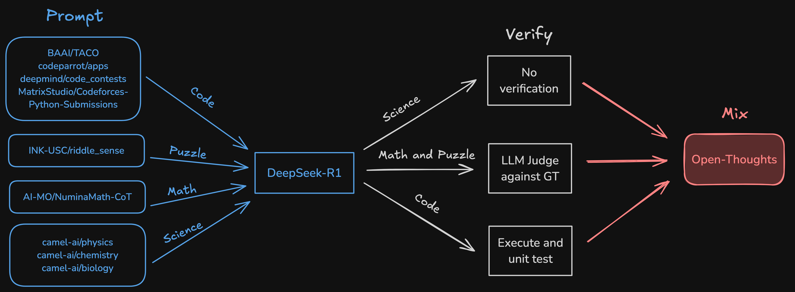

<!-- markdownlint-disable first-line-h1 -->
<!-- markdownlint-disable html -->
<!-- markdownlint-disable no-duplicate-header -->

<div align="center">
  
</div>
<p align="center">
  <a href="https://open-thoughts.ai">
    
  </a>
  <a href="https://huggingface.co/open-thoughts">
    
  </a>
  <br>
  <i>Curating the best open reasoning datasets</i><br> 
  A collaboration led by <a href="https://bespokelabs.ai/">Bespoke Labs</a> and the <a href="https://www.datacomp.ai/">DataComp</a> community

</p>
<hr>

Our first goal is to curate a reasoning dataset to train state-of-the-art small reasoning models that surpass [DeepSeek-R1-Distill-Qwen-32B](https://huggingface.co/deepseek-ai/DeepSeek-R1-Distill-Qwen-32B) and [DeepSeek-R1-Distill-Qwen-7B](https://huggingface.co/deepseek-ai/DeepSeek-R1-Distill-Qwen-7B) on math and code reasoning benchmarks.


# News
- **[2025/04/03]** 🎉 We release [OpenThoughts2-1M](https://huggingface.co/datasets/open-thoughts/OpenThoughts2-1M), [OpenThinker2-7B](https://huggingface.co/open-thoughts/OpenThinker2-7B), and [OpenThinker2-32B](https://huggingface.co/open-thoughts/OpenThinker2-32B).
- **[2025/03/13]** 🎉 [OpenThoughts Alice in Wonderland Blogpost](https://www.open-thoughts.ai/blog/aiw) is out.
- **[2025/02/16]** 🎉 [OpenThinker on Ollama](https://ollama.com/library/openthinker) reaches 400k downloads.
- **[2025/02/14]** 🎉 Chat with OpenThinker in the [online playground](https://playground.bespokelabs.ai/).
- **[2025/02/13]** 🎉 OpenThinker is now [available on Ollama](https://ollama.com/library/openthinker) for easy local inference.
- **[2025/02/12]** 🎉 We release [OpenThinker-32B](https://huggingface.co/open-thoughts/OpenThinker-32B), the [best open-data reasoning model](https://www.open-thoughts.ai/blog/scale).
- **[2025/02/02]** 🎉 [OpenThoughts-114k dataset](https://huggingface.co/datasets/open-thoughts/OpenThoughts-114k) is the #1 trending dataset on Hugging Face.
- **[2025/01/30]** 🎉 Reasoning benchmarks are added to [Evalchemy](https://github.com/mlfoundations/Evalchemy) and [compared](https://www.open-thoughts.ai/blog/measure) to publicly reported scores.
- **[2025/01/28]** 🎉 [Open Thoughts](https://www.open-thoughts.ai/) launches with [OpenThoughts-114k dataset](https://huggingface.co/datasets/open-thoughts/OpenThoughts-114k) and [OpenThinker-7B model](https://huggingface.co/open-thoughts/OpenThinker-7B).
- **[2025/01/27]** 🎉 [Bespoke-Stratos-17k dataset](https://huggingface.co/datasets/bespokelabs/Bespoke-Stratos-17k) is the #2 trending dataset on Hugging Face.
- **[2025/01/22]** 🎉 [Bespoke-Stratos-17k dataset](https://huggingface.co/datasets/bespokelabs/Bespoke-Stratos-17k) and [Bespoke-Stratos-32B model](https://huggingface.co/bespokelabs/Bespoke-Stratos-32B) are [announced](https://www.bespokelabs.ai/blog/bespoke-stratos-the-unreasonable-effectiveness-of-reasoning-distillation).

# Results
The numbers reported in the table below are evaluated with our open-source tool [Evalchemy](https://github.com/mlfoundations/Evalchemy).

[OpenThinker2-32B](https://huggingface.co/open-thoughts/OpenThinker2-32B) vs other 32B models
| Model            | Open Data? | Avg  | AIME24 | AIME25 | AMC23 | MATH500 | GPQA-D | LCBv2 |
| ---------------- | ---------- | ---- | ------ | ------ | ----- | ------- | ------ | ----- |
| OpenThinker-32B  | ✅          | 72.6 | 68.0   | 49.3   | 95.5  | 90.6    | 63.5   | 68.6  |
| OpenThinker2-32B | ✅          | 76.1 | 76.7   | 58.7   | 94.0  | 90.8    | 64.1   | 72.5  |
| R1-Distill-32B   | ❌          | 74.9 | 74.7   | 50.0   | 96.5  | 90.0    | 65.8   | 72.3  |
| Light-R1-32B     | ✅          | 72.9 | 74.7   | 58.0   | 96.0  | 90.4    | 62.0   | 56.0  |
| QwQ-32B          | ❌          | 80.9 | 78.0   | 62.0   | 98.0  | 91.6    | 66.3   | 89.2  |

[OpenThinker2-7B](https://huggingface.co/open-thoughts/OpenThinker2-7B) vs other 7B models
| Model            | Open Data? | Avg  | AIME24 | AIME25 | AMC23 | MATH500 | GPQA-D | LCBv2 |
| ---------------- | ----- | ---- | ------ | ------ | ----- | ------- | ------ | ----- |
| OpenThinker-7B   | ✅     | 48.9 | 31.3   | 23.3   | 74.5  | 83.2    | 42.9   | 38.0  |
| OpenThinker2-7B  | ✅     | 61.0 | 50.0   | 33.3   | 89.5  | 88.4    | 49.3   | 55.6  |
| R1-Distill-7B    | ❌     | 61.3 | 57.3   | 33.3   | 92.0  | 89.6    | 47.3   | 48.4  |
| OlympicCoder-7B  | ✅     | 42.4 | 20.7   | 15.3   | 63.0  | 74.8    | 25.3   | 55.4  |
| OpenR1-7B        | ✅     | 48.4 | 48.7   | 34.7   | 88.5  | 87.8    | 21.2   | 9.5   |

To mitigate variance in evaluation accuracy, we compute average scores over multiple evaluation runs with different seeds. We average over 5 runs for AIME and AMC, and 3 runs for the other tasks. No system prompt is used, the maximum token length is set to 32,768, and temperature is 0.7.

We are fully open-source. Our [model weights](https://huggingface.co/open-thoughts), [datasets](https://huggingface.co/open-thoughts), [data generation code](https://github.com/open-thoughts/open-thoughts), [evaluation code](https://github.com/mlfoundations/Evalchemy), and [training code](https://github.com/hiyouga/LLaMA-Factory) are all publicly available. 

# Installation
```
make install
poetry shell
```
Set the DeepSeek API key:
```
export DEEPSEEK_API_KEY=your_api_key
```

Set HF_ORG to your organization id. Set HF_PRIVATE=true if you want to push to a private repo.
```
export HF_ORG=your_org_id
export HF_PRIVATE=false
```

# OpenThoughts2-1M Data Generation
The [OpenThoughts2-1M](https://huggingface.co/datasets/open-thoughts/OpenThoughts2-1M) dataset is a combination of [OpenThoughts-114k](https://huggingface.co/datasets/open-thoughts/OpenThoughts-114k), [OpenR1](https://huggingface.co/open-r1), and our newly generated math and code reasoning data. We generate the additional math and code data by ablating on various question generation methodologies and sampling from the highest performing ones.

The recipe is outlined below:
<picture>
    <source media="(prefers-color-scheme: light)" width="100%" srcset="images/openthoughts2-diagram.png">
    
</picture>

More details can be found in our [blog post](). 


# OpenThoughts-114k Data Generation

For OpenThoughts-114k, we generate data for the following domains:
1. Code
2. Math
3. Science
4. Puzzle

The recipe is outlined below:
<picture>
    <source media="(prefers-color-scheme: light)" width="100%" srcset="images/diagram.png">
    
</picture>

More instructions are in [open_thoughts/README.md](open_thoughts/README.md).


# Training and Evaluation
Training and evaluation code coming soon.

# Links
- 📊 [OpenThoughts2 and OpenThinker2 Blog Post]()
- 💻 [Open Thoughts GitHub Repository](https://github.com/open-thoughts/open-thoughts)
- 🧠 [OpenThoughts2-1M dataset](https://huggingface.co/datasets/open-thoughts/OpenThoughts2-1M)
- 🤖 [OpenThinker2-7B model](https://huggingface.co/open-thoughts/OpenThinker2-7B)
- 🤖 [OpenThinker2-32B model](https://huggingface.co/open-thoughts/OpenThinker2-32B)

# Citation
```
@misc{Open Thoughts,
  author = {Open Thoughts Team},
  month = jan,
  title = {{Open Thoughts}},
  year = {2025}
}
```

# About Us

We are a team of researchers and engineers from [Bespoke Labs](https://www.bespokelabs.ai/), Stanford, University of California Berkeley, University of Washington, UT Austin, Juelich Supercomputing Center (JSC), LAION, UCLA, UNC Chapel Hill, UT Austin, and Toyota Research Institute united around building the best datasets (and thus the best models). See our previous works at [datacomp.ai](https://www.datacomp.ai/) and [mlfoundations](https://github.com/mlfoundations).

# Sponsors
Open Thoughts is supported by 
- [Bespoke Labs](https://www.bespokelabs.ai/)
- [Lambda Labs](https://lambdalabs.com/)
- [NSF IFML](https://www.ifml.institute/)
- [UT Austin Machine Learning Lab](https://ml.utexas.edu/)
- [Juelich Supercomputing Center](https://www.fz-juelich.de/en/ias/jsc)
- [Toyota Research Institute](https://www.tri.global)
