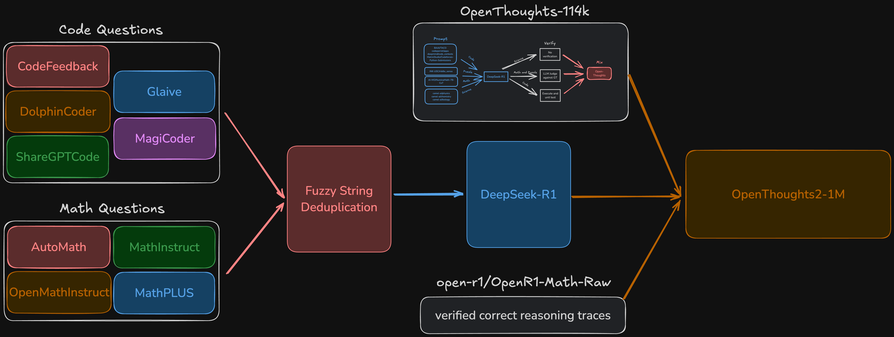

## OpenThoughts2-1M

The OpenThoughts2-1M dataset was used to train the OpenThinker2-7B and OpenThinker2-32B models. 

It is a combination of [OpenThoughts-114k](https://huggingface.co/datasets/open-thoughts/OpenThoughts-114k), [OpenR1-Math-Raw](https://huggingface.co/datasets/open-r1/OpenR1-Math-Raw), and our newly generated math and code reasoning data. We generate the additional math and code data by ablating on 26 different question generation methodologies and sampling from the highest performing ones.

<picture>
    <source media="(prefers-color-scheme: light)" width="100%" srcset="../images/openthoughts2-diagram.png">
    
</picture>

More details can be found in our [blog post](https://www.open-thoughts.ai/blog/thinkagain). 

**NOTE: data generation code for OpenThoughts2-1M will be available soon**. 

Similar to [OpenThoughts-114k](https://huggingface.co/datasets/open-thoughts/OpenThoughts-114k), we will provide python scripts so others can reproduce and build on the data generation pipeline. 
